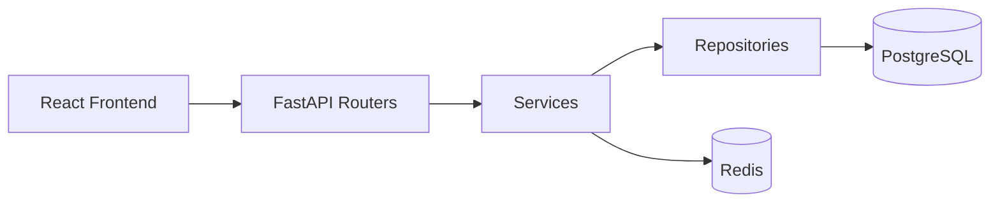

# Personal Expense Manager (MVP)

Fullstack personal expense manager with FastAPI + PostgreSQL + Redis + React.

## Table of Contents

- [Features](#features)
- [Tech Stack](#tech-stack)
- [Architecture](#architecture)
- [Project Structure](#project-structure)
- [Run with Docker](#run-with-docker)
- [Local Development](#local-development)
- [Environment Variables (Backend)](#environment-variables-backend)
- [Test](#test)
- [API Modules](#api-modules)
- [Notes](#notes)

## Features

- Auth: register/login/refresh/logout with JWT access + refresh
- RBAC: `admin` and `user`
- Modules: categories, expenses, budgets, monthly stats
- CSV export for expenses (`/expenses/export`)
- PostgreSQL + Alembic migration
- Redis: login rate-limit + stats cache
- Docker Compose: `api`, `db`, `redis`
- Tests: auth flow, expense isolation, stats cache invalidation
- Clean Swagger/OpenAPI docs at `/docs`

## Tech Stack

- Backend: FastAPI, SQLAlchemy 2 (async), Alembic, Redis, PostgreSQL
- Frontend: React + TypeScript + Vite
- Testing: pytest, pytest-asyncio, httpx

## Architecture



Layer rule: `router -> service -> repository -> db`.

## Project Structure

```text
personal-expense-manager/
  backend/
    app/
      main.py
      core/
      db/
      models/
      schemas/
      repositories/
      services/
      api/v1/routers/
      tests/
    alembic/
    Dockerfile
    requirements.txt
  frontend/
    src/
      api/
      pages/
      components/
      hooks/
      router/
  docker-compose.yml
  README.md
```

## Run with Docker

```bash
docker compose up --build
```

Then run migration:

```bash
docker compose exec api alembic upgrade head
```

Open API docs:

- [Swagger UI](http://localhost:8000/docs)
- [OpenAPI JSON](http://localhost:8000/openapi.json)

## Local Development

### Backend

```bash
cd backend
python -m venv .venv
source .venv/bin/activate
pip install -r requirements.txt
cp .env.example .env
alembic upgrade head
uvicorn app.main:app --reload
```

### Frontend

```bash
cd frontend
npm install
npm run dev
```

Default API base URL for frontend: `http://localhost:8000/api/v1`

## Environment Variables (Backend)

See [`backend/.env.example`](backend/.env.example)

## Test

```bash
cd backend
pytest
```

## API Modules

- `Auth`: `/api/v1/auth/*`
- `Categories`: `/api/v1/categories`
- `Expenses`: `/api/v1/expenses`
- `Budgets`: `/api/v1/budgets`
- `Stats`: `/api/v1/stats/monthly`

## Notes

- Access token is short-lived and stateless.
- Refresh token is stored in DB by `jti` and can be revoked.
- `stats:{user_id}:{month}` cache is invalidated on expense/budget changes.
